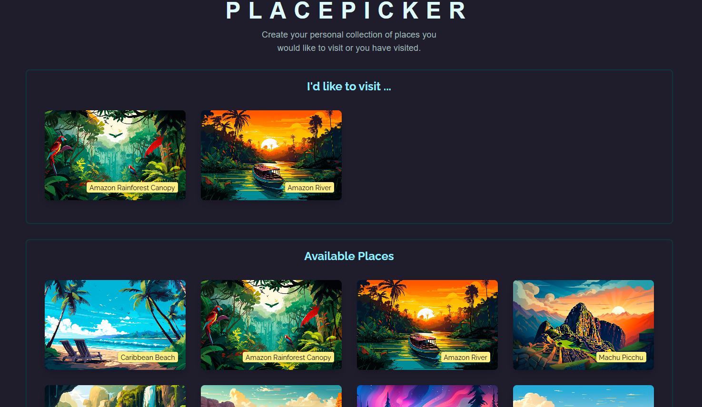

# PLACEPIKCKER

This is a small project developed with React, featuring a dummy backend in Node.js. It allows you to create a personal collection of places you wish to visit or have already visited.

## Table of contents

- [Overview](#overview)
  - [Screenshot](#screenshot)
- [My process](#my-process)
  - [Built with](#built-with)
  - [What I learned](#what-i-learned)
  - [Continued development](#continued-development)
  - [Useful resources](#useful-resources)
- [Author](#author)
- [Acknowledgments](#acknowledgments)

## Overview

### Screenshot



## My process

### Built with

- React
- Node JS
- Semantic HTML5 markup
- CSS custom properties
- CSS Flex box

### What I learned

While working on this project, I learned how to build the frontend based on the backend by effectively managing data. I also gained proficiency in using custom hooks in React and utilizing navigator tools.

```js
const places = await fetchAvailablePlaces();

return new Promise((resolve) => {
  navigator.geolocation.getCurrentPosition((position) => {
    const sortedPlaces = sortPlacesByDistance(
      places,
      position.coords.latitude,
      position.coords.longitude
    );
    resolve(sortedPlaces);
  });
});
```

```js
export async function fetchUserPlaces() {
  const response = await fetch("http://localhost:3000/user-places");
  const resData = await response.json();

  if (!response.ok) {
    throw new Error("Failed to fetch user places");
  }

  return resData.places;
}
```

### Continued development

My goal is to further enhance my understanding of React hooks and custom hooks as I develop the app and ensure seamless integration with the backend.

### Useful resources

- [Example resource 1](https://www.udemy.com) - I developed this small application through the course Dive in and learn React.js from scratch! by Maximilian Schwarzmüller - Udemy.

## Author

- Website - [Daniela Serrano](https://github.com/danielaser)

## Acknowledgments

As a junior developer, I found the Udemy course Dive in and Learn React.js from Scratch! by Maximilian Schwarzmüller to be incredibly valuable. It has helped me create cleaner React applications and gain a better understanding of key concepts.
